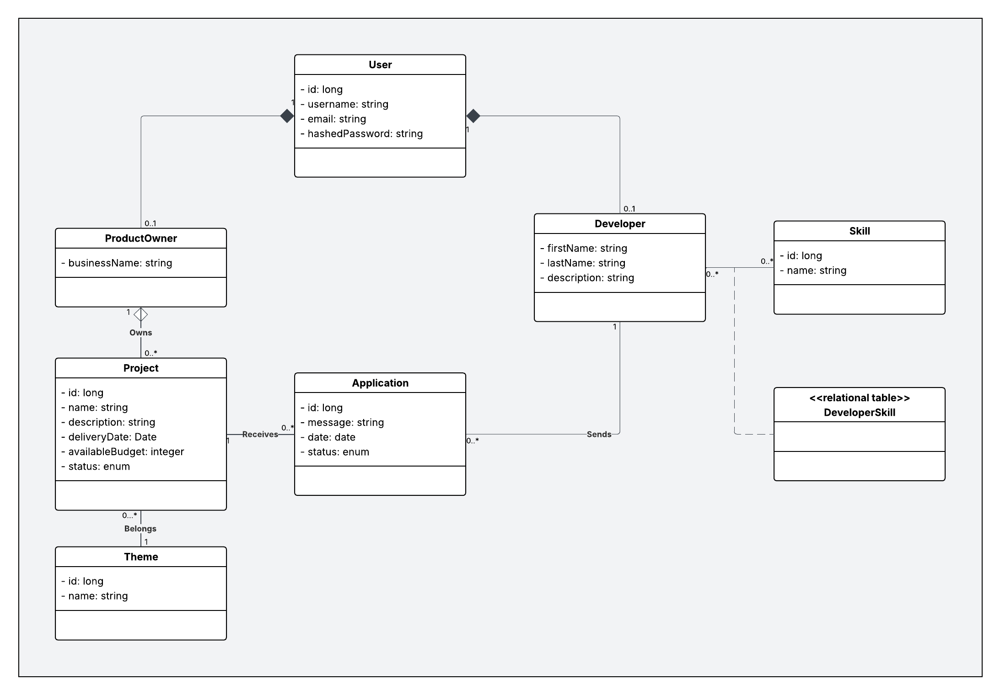

# Project ORM

Author: Mathieu LANGUMIER

## Description

A small Hibernate / JPA project where we set up the application to allow product owners to show their ideas, and developers to apply and participate in these projects.  
Project's description and expected features [here](https://gitlab.com/jeandemel-formations/hb-cda-2025/projets/projet-orm).

## Start the project

Start a MySQL docker container (install Docker first if you don't have it) : 
```shell
  docker compose up -d
```

Then read the `Main.java` file. 

## Conception

[UML Class Diagram on Lucid Chart](https://lucid.app/lucidchart/1a1f7d1a-0577-4b70-a9d6-a9bb018146b1/edit?invitationId=inv_c1c8775b-76a6-4499-bb4e-a7076c3b8f52)

